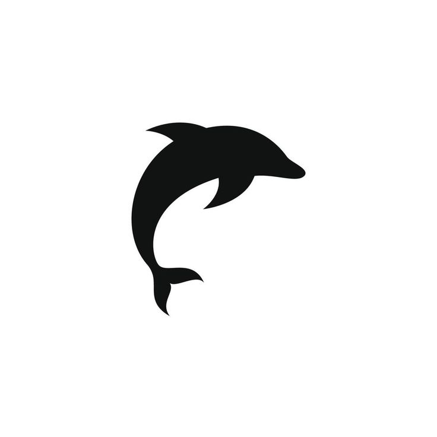
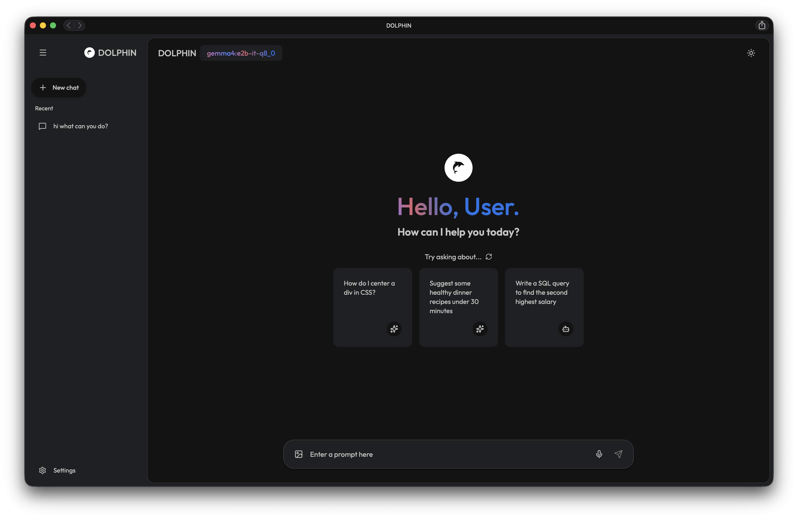
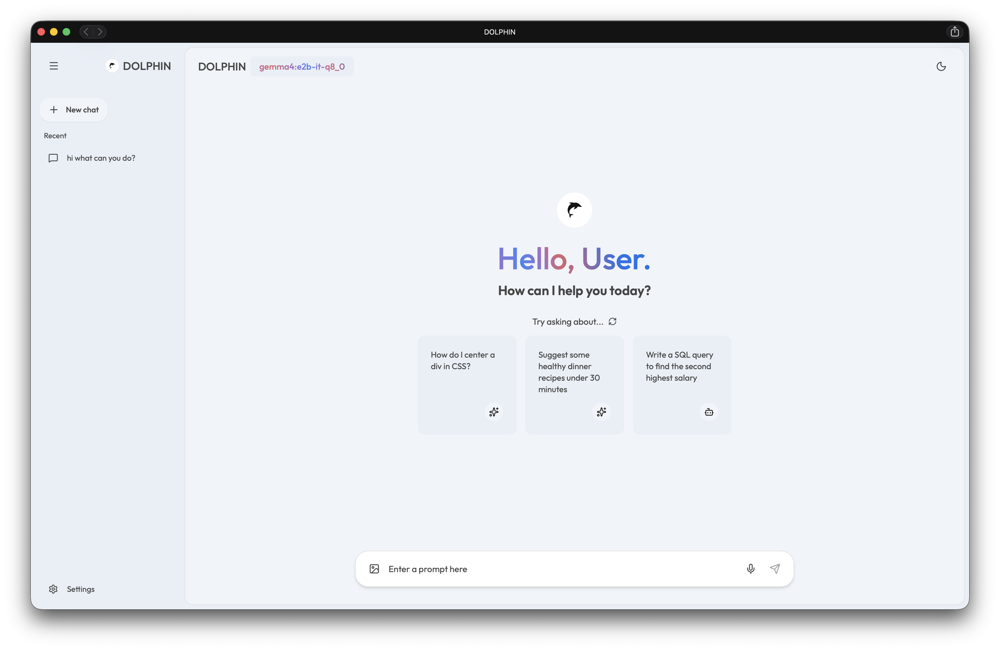
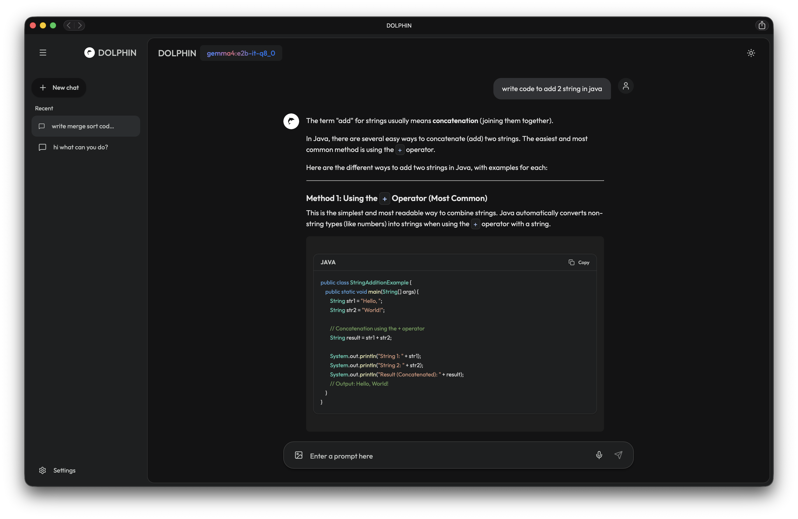
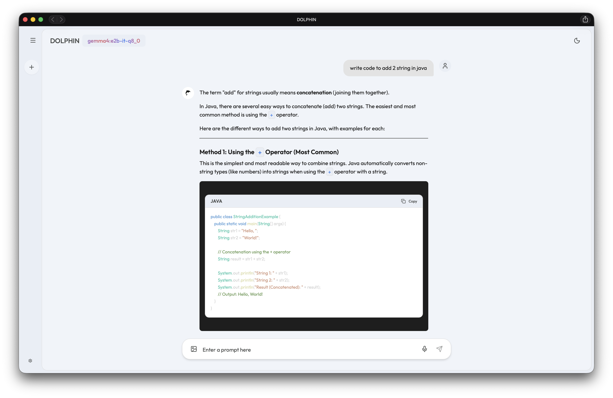

# 🐬 DOLPHIN

**A stunning, local-first, privacy-focused interface for Large Language Models.**

<p align="center">
  
</p>

---

## 📸 Application Showcase

Here is a look at Dolphin in action:

<p align="center">
  
  &nbsp;
  
</p>
<p align="center">
  
  &nbsp;
  
</p>

---

## 🌟 The Problem It Solves & Why I Built This

In today's AI landscape, we are increasingly reliant on cloud-based services like ChatGPT, Claude, and Gemini. While these tools are incredible, they come with three significant drawbacks:

1. **Zero Privacy**: Every prompt you send, every piece of confidential code you paste, and every private idea you brainstorm is transmitted to a remote corporate server and frequently logged.
2. **Subscription Fatigue**: Accessing premium LLM capabilities requires expensive, compounding monthly subscriptions.
3. **Internet Dependency**: You absolutely cannot use these tools on an airplane, in a remote location, or during an internet outage.

**DOLPHIN was built to solve these problems entirely.**

I engineered Dolphin to serve as a gorgeous, frictionless front-end for [Ollama](https://ollama.com/). It allows anyone to run highly capable, uncensored open-source models (like *Llama 3*, *Mistral*, and *LLaVA*) natively on their Mac, Windows PC, or even directly on an Android smartphone via Termux. 

It grants you the premium, sleek experience of a top-tier commercial AI application, but **no internet is required, no data ever leaves your hardware, and it is 100% free forever.**

---

## ✨ Key Features

- 🎨 **Premium UI/UX**: A gorgeous dark-mode interface meticulously designed to feel modern, sleek, and highly responsive.
- 🌊 **Fluid UI Animations**: Features a unified, responsive brand header that seamlessly glides between the sidebar and the beautifully centered chat layout as you navigate.
- 📸 **Multi-Modal Vision Support**: Attach and preview images directly in the composer to chat with vision models.
- 🧠 **Built-in Model Manager**: Pull, track download progress, and delete Ollama models directly from the UI settings.
- 💻 **IDE-Grade Code Blocks**: Beautiful syntax highlighting leveraging premium developer fonts, rounded UI cards, and instant "Copy Code" visual feedback.
- 💾 **Persistent Memory**: All chat histories and active conversations are automatically saved locally and survive page refreshes.
- 📊 **Hardware Diagnostics**: Real-time system monitoring panel displaying your active CPU cores, RAM estimation, and GPU context.
- 📱 **Progressive Web App (PWA)**: Fully responsive and natively installable as an app on your mobile device or desktop for offline usage.
- 📜 **Smart Auto-Scroll**: Intelligent scroll locking ensures you can freely scroll up to read past messages without the live LLM stream forcing you back to the bottom.

---

## 🚀 Installation & Setup

### Option A: Standard Desktop (Mac / Windows / Linux)

1. **Install Ollama**: Ensure [Ollama](https://ollama.com/) is installed and running in the background.
2. **Clone the Repository**:
   ```bash
   git clone https://github.com/sdenaveenkumar/dolphin.git
   cd dolphin
   ```
3. **Install Dependencies**:
   ```bash
   npm install
   ```
4. **Start the Application**:
   ```bash
   npm run dev
   ```
5. Open your browser and navigate to `http://localhost:5173`.
6. **Go Completely Offline (No Server Needed)**:
   - While viewing Dolphin in your browser (Chrome/Edge/Brave), click the **Install App** icon on the far right side of your URL address bar.
   - Dolphin will instantly install as a standalone native desktop application.
   - You can now terminate the `npm run dev` server in your terminal! Going forward, just launch Dolphin directly from your computer's app launcher to use it 100% offline. *(Note: Ollama must still be running in the background to serve the AI).*

---

### Option B: The "Ultimate Local" Mobile Setup (Android via Termux)

Want to run Dolphin entirely on your Android phone, completely offline?

1. **Prepare Termux**: Install the Termux app on your Android device.
2. **Clone & Run**:
   Inside Termux, run:
   ```bash
   pkg install git nodejs
   git clone https://github.com/sdenaveenkumar/dolphin.git
   cd dolphin
   npm install
   npm run dev
   ```
3. **Install the App**:
   - Open Chrome on your Android phone and navigate to `http://127.0.0.1:5173`.
   - Your browser will automatically prompt you to **"Install App"**.
   - Tap Install. The Dolphin logo will be added to your home screen!
4. **Offline Forever**:
   Because Dolphin is a Progressive Web App (PWA), your phone will cache the UI. You can now stop the Termux server. Going forward, just tap the Dolphin icon on your home screen to instantly load the app offline! *(Note: You will still need Termux running your Ollama instance for the AI to reply).*

---

## 🛠️ Tech Stack
- **Frontend**: React (Vite)
- **Styling**: Pure Vanilla CSS
- **Icons**: Lucide React
- **Markdown Rendering**: React Markdown & React Syntax Highlighter
- **AI Engine**: Local Ollama REST API

## 📝 License
This project is open-source and free to use.
